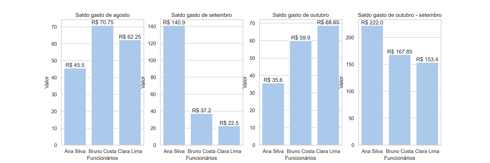

# Analise Estante Literaria


Projeto desenvolvido com o intuito de realizar uma analise do saldo gasto de cada funcionario dentro de uma loja de livros ficticia, Estante Literaria. Utilizando de bancos de dados criados usando o SQLite e analise com python.

### 🚀 Funcionalidades

- Compara banco de vendas com o de funcionários para realizar apenas a soma de saldo dos funcionarios.
- Cria banco de dados com a soma do saldo gasto de cada funcionario por mês.
- Cria graficos comparando os valores e exporta banco de dados criado como exel.

### 👀 Demonstração

#### Exemplos de graficos gerados




### 💻 Tecnologias utilizadas

- SQLite
- Python 3.13
- Bibliotecas: Pandas, Matplotlib, Seaborn

### 📲 Instalação

1. Clone o repositório:

```bash
git clone https://github.com/Murilo-front/Analise-Estante-Literaria.git meu-projeto
```

2. Acesse a pasta do projeto:

```bash
cd meu-projeto
```

3. Instale as dependências:

```bash
pip install -r requirements.txt
```

4. Como usar:

- python main.py ou

- Use um editor como o Visual Studio Code e a extensão Python.
